# *Ada*MAE: Adaptive Masking for Efficient Spatiotemporal Learning with Masked Autoencoders

*Left to right*: **(1)** Video, **(2)** Predicted video (mask ratio = 95%), **(3)** Prediction error (MSE), **(4)** Predicted categorical distribution, **(5)** Sampled mask

From $SSv2$ (samples from $50th$ epoch)

<p float="left">
  
   
</p>

 
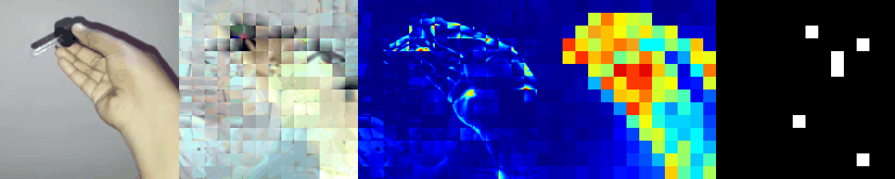


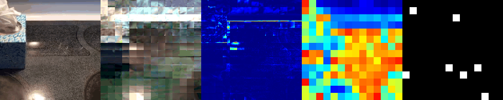
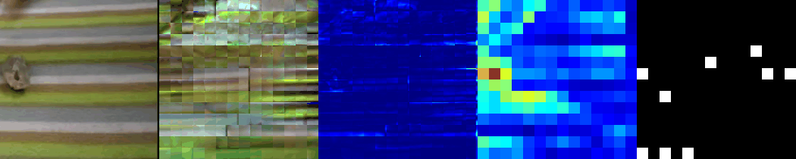

From $K400$ (samples from $50th$ epoch)

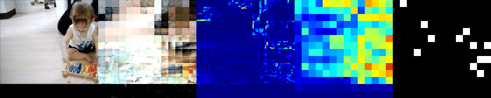
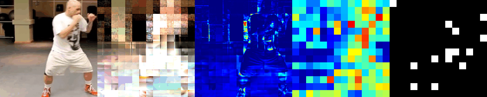
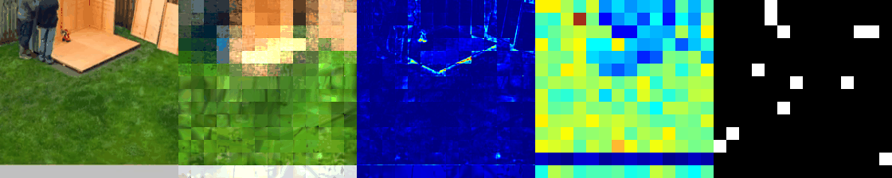


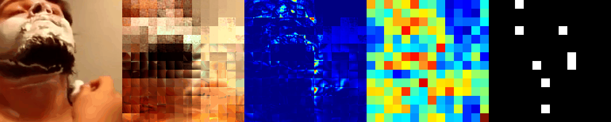
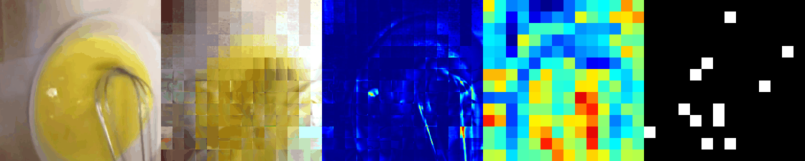


- We propose *Ada*MAE, a novel, adaptive, and end-to-end trainable token sampling strategy for MAEs that takes into account the spatiotemporal properties of all input tokens to sample fewer but informative tokens.

- We empirically show that *Ada*MAE samples more tokens from high spatiotemporal information regions of the input, resulting in learning meaningful representations for downstream tasks.

- We demonstrate the efficiency of *Ada*MAE in terms of performance and GPU memory against random *patch*, *tube*, and *frame* sampling by conducting a thorough ablation study on the SSv2 dataset.

- We show that our *Ada*MAE outperforms state-of-the-art (SOTA) by $0.7\%$ and $1.1\%$ (in top-1) improvements on $SSv2$ and $Kinetics-400$, respectively.

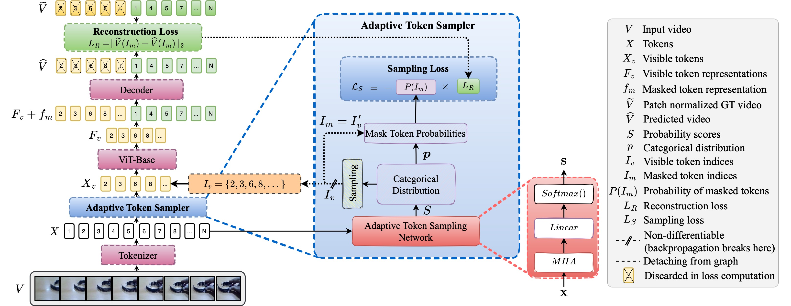


## A comparision

Comparison of our adaptive masking with existing random *patch*, *tube*, and *frame* masking for masking ratio of 80\%.} Our adaptive masking approach selects more tokens from the regions with high spatiotemporal information while a small number of tokens from the background.

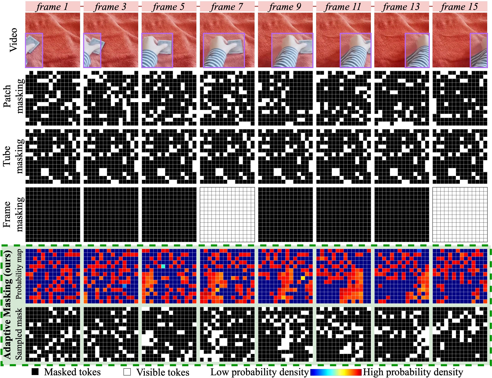

## Ablation experiments on SSv2 dataset

We use ViT-Base as the backbone for all experiments. MHA $(D=2, d=384)$ denotes our adaptive token sampling network with a depth of two and embedding dimension of $384$.  All pre-trained models are evaluated based on the evaluation protocol described in Sec. 4. The default choice of our *Ada*MAE is highlighted in gray color. The GPU memory consumption is reported for a batch size of 16 on a single GPU.

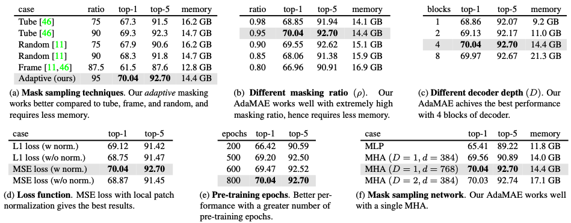


## Acknowledgement
Our AdaMAE codebase is based on the implementation of VideoMAE paper. We thank the authors of [**VideoMAE**](https://github.com/MCG-NJU/VideoMAE.git) for making their code available to the public.


## Citation
```
```
